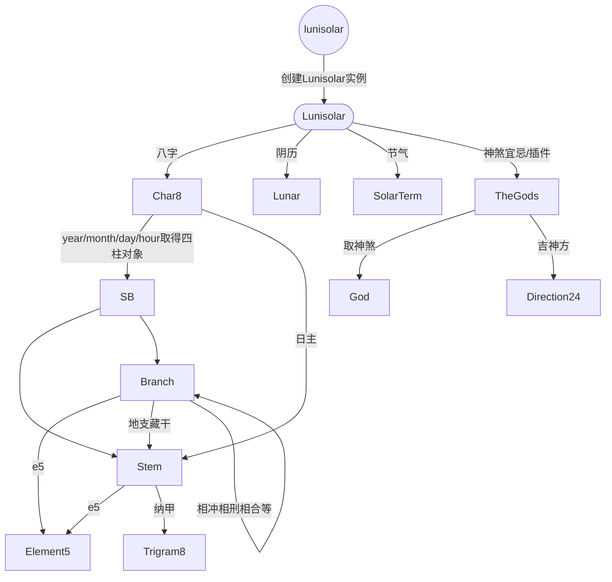

# 前言

## * 简介

**lunisolar.js**是一个专业的Javascript农历工具库。支持各类农历信息查询，如天干地支、五行纳音、神煞宜忌、建除十二神、八字十神、四柱神煞、胎神占方、每日吉时、每日吉神方等。使用Typescript编写，主体代码压缩后只有11.5KB左右。简单易上手。

## * 为何制作此库

昔见不同版本日历（包括纸质日历和各类日历软件），其所示宜忌有所不同，更有相矛盾者，不知如何取用，故疑其推算依据是否误，本着宏扬传统文化之精神，查阅各资料文案，以制此库。

## * 阴历和阳历

现所用的中国传统历法，我们常称为**农历**，农历是阴阳合历，即包含了`阴历`和`阳历`，所以此库取`lunar`+`solar`，命名为**lunisolar**。

农历中，通过月相圆缺纪月，此属于**阴历**范畴，本库会以一个`Lunar`对象记录转换好的阴历数据。
而公历与阴历的转换规律性不大，使用[寿星天文历](https://github.com/sxwnl/sxwnl)的计算方式又过于复杂也影响代码体积，故本库的核心采用查表法进行转换，其数据来自香港天文台【[公历与农历日期对照表](https://www.hko.gov.hk/tc/gts/time/conversion1_text.htm#)】。其可查询年份范围为`[1901,2100]`。数据抓取和压缩的代码见仓库 [lunar-crawler](https://github.com/waterbeside/lunar-crawler)，此处不作详细介绍。

属于阳历范畴的内容比较多，有二十四节气、天干地支等，传统很多术数多以阳历排盘，如八字、奇门遁甲...（也有少数以阴历排盘的，如紫微斗数）。其中二十四节气是阳历中十分重要的部分，其影响天干地支的**换岁**和**换月**。

## * 年和岁

过去，年和岁是两个不同的概念。

**年** 是指阴历正月初一到下一个正月初一的一个周期。

**岁** 是指太阳连续两次通过春分点的时间间隔，古人一般用‘冬至点’来观测，现代称作**回归年（tropical year）**，也叫 **太阳年（solar year）**。一个周期结束而开始下一个周期，称为`换岁`。

> 1回归年 = 365.2421990741日 = 365天5小時48分46秒

## * 节和气

我们常说的二十四节气，其实分为**节**和**气**，共十二节和十二气，节和气交替出现。天干地支纪月是以节换月的。

|      |     |     | 节   | 气   | 
| ---  | ---  | ---  | --- | --- |
|    | 孟春 | 寅月 | 立春 | 雨水 |
| **春** | 仲春 | 卯月 | 惊蛰 | 春分 |
|    | 季春 | 辰月 | 清明 | 谷雨 |
|    | 孟夏 | 巳月 | 立夏 | 小满 |
| **夏** | 仲夏 | 午月 | 芒种 | 夏至 |
|    | 季夏 | 未月 | 小暑 | 大暑 |
|    | 孟秋 | 申月 | 立秋 | 处暑 |
| **秋** | 仲秋 | 酉月 | 露水 | 秋分 |
|    | 季秋 | 戌月 | 寒露 | 霜降 |
|    | 孟冬 | 亥月 | 立冬 | 小雪 |
| **冬** | 仲冬 | 子月 | 大雪 | 冬至 |
|    | 季冬 | 丑月 | 小寒 | 大寒 |

实际上，节气是某一个时刻，而这个时刻并不是固定在某天的某个时辰。但由于数据源只精确到日，所以本库的交节（更换八字月柱），也是以日为准。

## * 生肖和换岁

我们知道天干地支是基于二十四节气来定的。在民间，如八字命理这类术数，通常以**立春**换岁，即到了立春，便更换下一个天干地支纪年，例如今年为甲子年，则到下一个立春，则换成乙丑年。

但是，并不是所有术数都是以立春换岁，例如中医的五运六气，则以大寒日换岁。 而奇门遁甲则以冬至换岁，中气换月。

> `lunisolar`默认使用**立春**换岁, 当然你也可以自定义换岁的节气。

**生肖**：生肖与十二地支是对应的，所以实际上生肖也是按节气更换，民间传统上是以立春换岁，所以生肖也是按立春更换。

另外，跟据 中国大陆国家标准：编号**GB/T 33661-2017 《农历的编算和颁行》**规定,

> “干支纪年的循环参考时间：对应于北京时间公历1984年2月2日0时起到1985年2月19日24时截止的农历年为甲子年。”

如按此标准的话，应该正月初一换岁，即生肖在正月初一更换。
这与传统术数的计算方式有所冲突，也许是为了方便大众记忆与使用。
由于大部分术数系统并不以正月初一换岁，所以lunisolar默认并不跟随此标准进行换岁（虽然可以通过配置设置成与国标一致，但不建议）。

## * 换日

传统子时是每一天的开始，子时对应的时间为 [23:00, 01:00), 所以lunisolar会在23:00进行换日。

## * 其它

[moment.js](https://github.com/moment/moment) 和 [dayjs](https://github.com/iamkun/dayjs) 是两个比较出名的时间工具库，为了符合大家的使用习惯，`lunisolar`针对公历的部分操作将会尽量向`dayjs`看齐，并参考了其代码设计。针对公历部分，尽管lunisolar也有类似dayjs的方法，但并不会cover其所有功能，如果你仅仅是对公历进行操作，推荐使用**dayjs**。lunisolar重点在于农历部分，例如`Lunisolar`的`format`方法和`diff`方法包含`dayjs`这两个方法的功能并与之保持一致，同时加入了对农历的处理，具体功能及使用请继续阅读文档。

## 对象关系参考

lunisloar采用面向对象开发，下图可以帮助了解各个对象关系。

