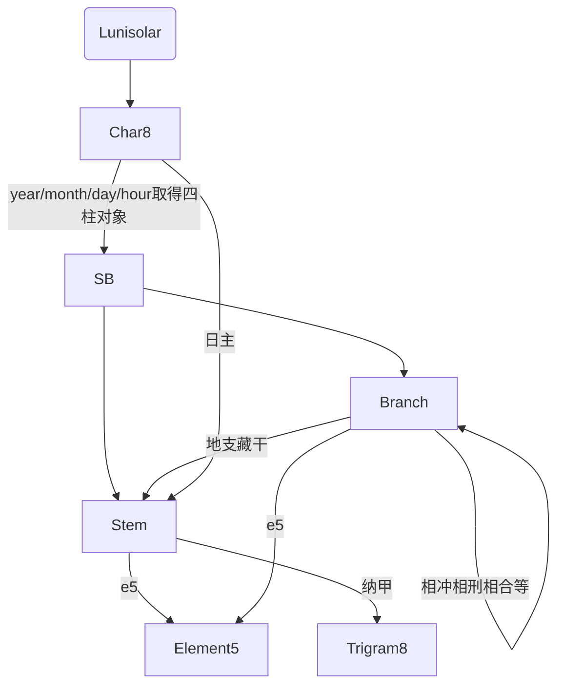

# 八字

::: info

- 八字实际上是用天干地支表示的历法
- 一个天干地支组合有两个字， 年月日时分别以天干地支表示，则共有八个字，
- 年、月、日、时用天干地支表示，分别称为年柱、月柱、日柱、时柱，所以八字又称为四柱
:::

Lunisolar实例上包含char8属性，返回一个[**Char8**](../../api/char8.md)实例，可取得相应天干支地支信息

## 对象关系图




## 年柱

取得年柱， 返回一个天干地支对象

```typescript
/**
 * @return {SB} 返回一个天干地支对象，SB为StemBranch简写
 */
lunisolar().char8.year
```

## 月柱

取得月柱， 返回一个天干地支对象

```typescript
/**
 * @return {SB}
 */
lunisolar().char8.month
```

## 日柱

取得日柱， 返回一个天干地支对象

```typescript
/**
 * @return {SB}
 */
lunisolar().char8.day
```

## 时柱

取得时柱， 返回一个天干地支对象

```typescript
/**
 * @return {SB}
 */
lunisolar().char8.hour
```

## 日主

取得日主，即日柱的天干，返回天干对象

```typescript
/**
 * @return {Stem}
 */
lunisolar().char8.me
```

## 天干地支

上述年月日时四柱返回的天干地支对象:[**SB**](../../api/sb.md)

```typescript
const sb = lunisolar().char8.day
```

### 取得天干

SB实例对象包含stem属性，返回一个Stem实例，可取得天干信息

```typescript
/**
 * @return {Stem}
 */
sb.stem 
```

### 取得地支

SB实例对象包含branch属性，返回一个Branch实例，可取得地支信息

```typescript
/**
 * @return {Branch}
 */
sb.branch
```

### 旬空

取得旬空的两个地支

```typescript
/**
 * @return {[Branch, Branch]}
 */
sb.missing
```

### 天干地支字符串

返回天干地支组合的字符串，如"甲子"

```typescript
/**
 * @return {string}
 */
sb.name
```

### 60天干地支索引

返回天干地支组合的索引值，范围为[0, 59], 从`甲子`开始，`癸亥`结束

```typescript
/**
 * @return {number}
 */
sb.value
```

### 60天干地支列表

此为静态方法，取得60甲子名称列表

```typescript
/**
 * @return {string[]}
 */
lunisolar.SB.getNames()
```
