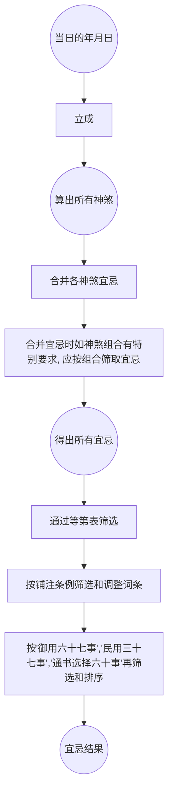

# 宜忌等第

:::info 参考
参考《钦定协纪辨方书》卷十
:::

宜忌是通过神煞吉凶所定，但同一天内，有可能同时存在吉神和凶煞，其所示之宜忌很有可能相矛盾，此时应按《宜忌等第表》和《铺注条例》进行取舍。

## 宜忌等第表

<GodGoodBadLevel />

## 铺注条例

凡铺注万年书通书先依用事次第察其所宜忌之日于某日下注宜某事某日下注忌某事次按宜忌较量其吉凶之轻重以定去取

凡宜宣政事布政事之日止注宜宣政事

凡宜营建宫室修宫室之日止注宜营建宫室

凡吉足胜凶从宜不从忌者如遇徳犹忌之事则仍注忌

凡吉凶相抵不注宜亦不注忌者如遇徳犹忌之事则仍注忌

凡徳合赦愿月恩四相时徳等日不注忌进人口安床经络醖酿开市立劵交易纳财开仓库出货财如遇徳犹忌及从忌不从宜之日则仍注忌

凡天狗寅日忌祭祀不注宜求福祈嗣

凡卯日忌穿井不注宜开渠壬日忌开渠不注宜穿井凡巳日忌出行不注宜出师遣使

凡酉日忌宴㑹亦不注宜庆赐赏贺

凡丁日忌剃头亦不注宜整容

凡吉凶相抵不注忌祈福亦不注忌求嗣

凡忌诏命公卿招贤不注宜施恩封拜举正直袭爵受封

凡忌施恩封拜举正直袭爵受封亦不注宜诏命公卿招贤

凡宜宣政事之日遇往亡则改宣为布

凡月厌忌行幸上官不注宜颁诏施恩封拜诏命公卿招贤举正直遇宜宣政事之日则改宣为布

凡吉凶相抵不注忌结婚姻亦不注忌冠带纳采问名嫁娶进人口如遇徳犹忌之日则仍注忌

凡吉凶相抵不注忌嫁娶亦不注忌冠带结婚姻纳采问名进人口般移安床如遇徳犹忌之日则仍注忌遇不将而不注忌嫁娶者亦仍注忌遇亥日厌对八专四忌四穷而仍注忌嫁娶者止注所忌之事其不忌者仍不注忌

凡吉凶相抵不注忌般移亦不注忌安床不注忌安床亦不注忌般移如遇徳犹忌之日则仍注忌

凡吉凶相抵不注忌解除亦不注忌整容剃头整手足甲如遇徳犹忌之日则仍注忌

凡吉凶相抵不注忌修造动土竖柱上梁亦不注忌修宫室缮城郭筑堤防修仓库鼓铸苫葢修置产室开渠穿井安碓硙补垣塞穴修饰垣墙平治道涂破屋壊垣如遇徳犹忌之日则仍注忌

凡吉凶相抵不注忌开市亦不注忌立劵交易纳财不注忌纳财亦不注忌开市立劵交易不注忌立劵交易亦不注忌开市纳财

凡吉凶相抵不注忌开市立劵交易亦不注忌开仓库出货财如遇专忌之日则仍注忌

凡吉凶相抵不注忌牧养亦不注忌纳畜不注忌纳畜亦不注忌牧养

凡吉凶相抵有宜安葬不注忌启攒有宜启攒不注忌安葬

凡土府土符地囊止注忌补垣亦不注宜塞穴

凡开日不注宜破土安葬启攒亦不注忌遇忌则注凡四忌四穷止忌安葬如遇鸣吠鸣吠对亦不注宜破土启攒

凡天吏大时不以死败论者遇四废岁薄逐阵仍以死败论

凡岁薄逐阵日所宜事照月厌所忌删所忌仍从本日二月甲戌四月丙申六月甲子七月戊申八月庚辰九月辛卯十月甲子十二月甲子徳合与赦愿所㑹之辰诸事不忌

## 宜忌推算流程

